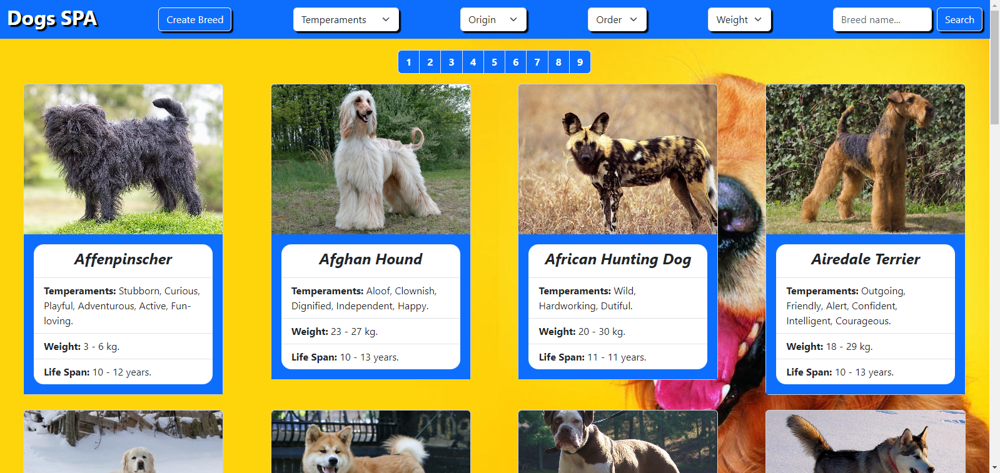
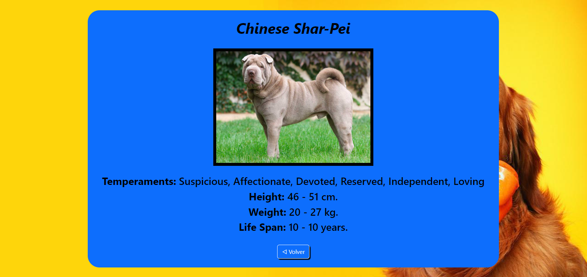
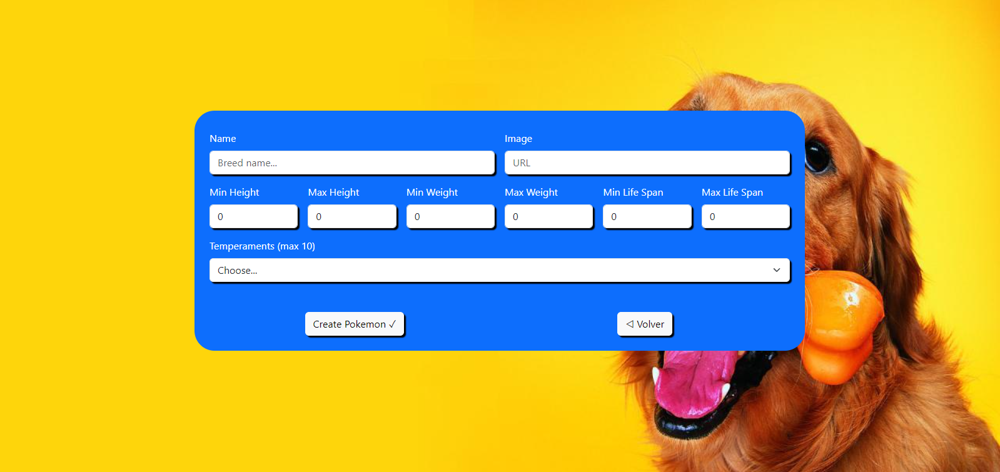

# Dogs - SPA (Deployado y Responsivo)

<p align="center">
  
</p>
<p align="center">
  
</p>
<p align="center">
  
</p>
<p align="center">
  
</p>

# Proyecto (Single Page Application) Dogs App #

#### ► Deploy Backend: https://dogs-spa.onrender.com/
#### ► Deploy Frontend: https://dogs-spa-ten.vercel.app/

#### Tecnologías necesarias:
- [ ] React
- [ ] Redux
- [ ] Express
- [ ] Sequelize
- [ ] Postgres

__IMPORTANTE__: Se utilizo Bootstrap y sus correspondientes estilos, ademas de CSS puro.

## Descripción 

Esta es una aplicación en la cual se pueden ver algunas razas de perros junto con información relevante de las mismas utilizando la api externa [the dog api](https://thedogapi.com/) y a partir de ella poder, entre otras cosas:

  - Buscar razas.
  - Filtrarlas / Ordenarlas.
  - Agregar nuevas razas propias por medio de un formulario.

### Endpoints/Flags:

  * GET https://api.thedogapi.com/v1/breeds
    - Para obtener mayor información sobre las razas de perros.
  * GET https://api.thedogapi.com/v1/breeds/search?q={raza_perro}
    - Para obtener mayor informacion de una raza especifica buscada por nombre.

#### Frontend

Aplicación de React/Redux que contenga las siguientes pantallas/rutas.

__Pagina inicial__: 
Landing page con:
- [ ] Imagen representativa al proyecto.
- [ ] Botón para ingresar al home (`Ruta principal`).

__Ruta principal__: debe contiene
- [ ] Input de búsqueda para encontrar razas de perros por nombre.
- [ ] Área donde se verá el listado de razas de perros. Deberá mostrar su
  - Imagen
  - Nombre
  - Temperamento
  - Peso
- [ ] Botones/Opciones para filtrar por:
  - Temperamento
  - Raza existente (es decir las que vienen de la API) o agregada por nosotros (creadas mediante el form)
- [ ] Botones/Opciones para ordenar tanto ascendentemente como descendentemente las razas de perro por:
  - Orden alfabético
  - Peso
- [ ] Paginado para ir buscando y mostrando las siguientes razas, mostrando 20 razas por página.

__IMPORTANTE__: Dentro de la Ruta Principal se muestran las razas traidas desde la API como así también las de la base de datos.

__Ruta de detalle de raza de perro__:
- [ ] Los campos mostrados en la ruta principal para cada raza (imagen, nombre y temperamento).
- [ ] Altura.
- [ ] Peso.
- [ ] Años de vida.

__Ruta de creación de raza de perro__: debe contener

- [ ] Un formulario controlado con JavaScript con los siguientes campos:
  - Peso
  - Nombre
  - Altura (Diferenciar entre altura mínima y máxima)
  - Peso (Diferenciar entre peso mínimo y máximo)
  - Años de vida
- [ ] Posibilidad de seleccionar/agregar uno o más temperamentos.
- [ ] Botón/Opción para crear una nueva raza de perro.

> El formulario de creación  esta validado con JavaScript y HTML. 

#### Base de datos

El modelo de la base de datos:

- [ ] Raza con las siguientes propiedades:
  - ID (Número de Pokemon) *
  - ID *
  - Nombre *
  - Altura *
  - Peso *
  - Años de vida
- [ ] Temperamento con las siguientes propiedades:
  - ID
  - Nombre

La relación entre ambas entidades debe ser de muchos a muchos ya que una raza de perro puede tener varios "temperamentos" en simultaneo y, a su vez, un "temperamento" puede corresponder a múltiples razas de perro distintas. Por ejemplo la raza pug es docil, inteligente y sociable (entre otras). Pero a su vez existen otras razas de perro que también son sociables o inteligentes.

#### Backend

Servidor en Node/Express con las siguientes rutas:

- [ ] __GET /dogs__:
  - Obtener un listado de las razas de perro.
  - Debe devolver solo los datos necesarios para la ruta principal.
- [ ] __GET /dogs?name="..."__:
  - Obtener un listado de las razas de perro que contengan la palabra ingresada como query parameter.
  - Si no existe ninguna raza de perro mostrar un mensaje adecuado.
- [ ] __GET /dogs/{idRaza}__:
  - Obtener el detalle de una raza de perro en particular.
  - Debe traer solo los datos pedidos en la ruta de detalle de raza de perro.
  - Incluir los temperamentos asociados.
- [ ] __GET /temperament__:
  - Obtener todos los temperamentos posibles.
  - En una primera instancia deberán obtenerlos desde la API externa y guardarlos en su propia base de datos y luego ya utilizarlos desde allí.
- [ ] __POST /dog__:
  - Recibe los datos recolectados desde el formulario controlado de la ruta de creación de raza de perro por body.
  - Crea una raza de perro en la base de datos.


## Descarga e instalación:

Forkear el repositorio o descargarlo para tener una copia del mismo 

__IMPORTANTE:__ Es necesario contar minimamente con la última versión estable de Node y NPM. Asegurarse de contar con ella para poder instalar correctamente las dependecias necesarias para correr el proyecto.

Actualmente las versiónes necesarias son:

 * __Node__: 12.18.3 o mayor
 * __NPM__: 6.14.16 o mayor

Para verificar que versión tienen instalada:

> node -v
>
> npm -v

## Inicio del Proyecto

El proyecto cuenta con dos carpetas: `api` y `client`. En estas carpetas estará el código del back-end y el front-end respectivamente.

En `api` crear un archivo llamado: `.env` que tenga la siguiente forma:

```
DB_USER=usuariodepostgres
DB_PASSWORD=passwordDePostgres
DB_HOST=localhost
```

Reemplazar `usuariodepostgres` y `passwordDePostgres` con tus propias credenciales para conectarte a postgres. 

Adicionalmente será necesario que creen desde psql una base de datos llamada `dogs`

El contenido de `client` fue creado usando: Vite.

Una vez abierto el proyecto es necesario iniciarlo: 

- Abrir en terminall integrado la carpeta `client`  y escribir `npm run dev`
- Abrir en terminall integrado la carpeta `api`  y escribir `npm start`

Todo listo!!!
